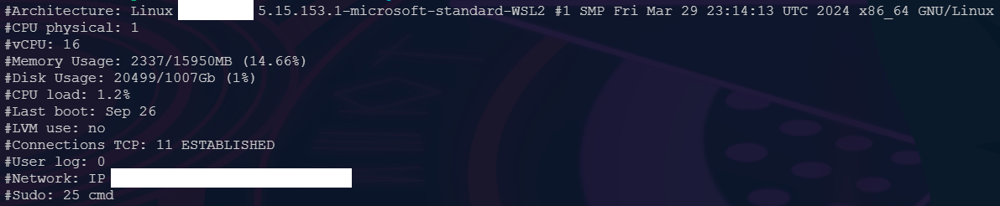

<h1 align="center">SysMon</h1>

<p align="center">
	
</p>

## Purpose

-   It's just a simple script to do show some informations about the current system, created mainly to be used in 42's Born2BeRoot Project.

## Usage

-   Simply run it like a normal Bash script and, given that you have all the basic dependencies, it will show the informations expected, at the default output of the terminal.

```Bash
bash ./monitoring.sh
```
